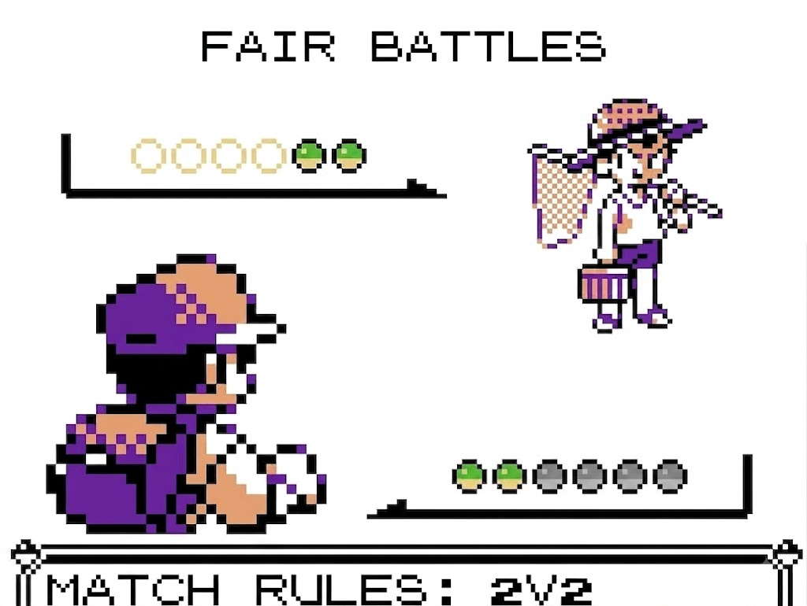

# gen1recomp - Fair Battles Mod

a QoL and somewhat of a dynamic scaling mod that limits your usable party size to match the number of PKM your opponent has.

while some difficulty mods/rom hacks try to make battles fairer by just increasing the number of PKM every opponent has, this mod takes the opposite approach to preserve the vanilla pacing. 
there's a reason early route trainers only pack 2 or 3 PKM—early game battles are naturally tedious when your entire moveset consists of just Tackle, Growl, and Water Gun —,
you really shouldn't have to waste time slogging through a Bug Catcher with 6 Metapods just to feel some baseline level of risk during your playthrough.

if you have 6 PKM and challenge a Youngster with 2, you will only be allowed to use the first 2 healthy PKM in your party. 
if both of your active PKM faint, you will white-out, regardless of the healthy PKM sitting in the back.

* **dynamic party limiting:** automatically matches your usable party size to the opponent's party size during trainer battles.
* **top-down selection:** the mod counts your healthy PKM from the top of your party down, putting the rest on the "bench" for the duration of the match.
* **wild battles anaffected:** restrictions only apply to trainer battles, allowing you to use your full party for wild encounters and catching.

## ⚠️ Alpha State Notice

this mod is currently in an early stage of development. 

to enforce the party limit behind the scenes, the mod currently temporarily sets the hp of your benched PKM to 0 (Fainted) during the match. bou cannot bypass these rules using Revives bcs the mod actively monitors the battle and will immediately "faint" benched PKM again to preserve the match limits. However, this generated a known issue, I see that the current implementation may cause confusion as the game's UI does not currently distinguish between PKM that are benched (and therefore cannot be revived) and those that actually fainted during the current battle (which are eligible for a Revive).

once the battle concludes, your benched PKM are seamlessly restored to their exact pre-battle HP and status conditions. 
future updates aim to replace this workaround with a cleaner, more native visual UI to indicate disabled PKM.

## Installation

Place the `fair_battles` folder directly into your `mods/` directory and ensure it is enabled in the game's Mod Manager.